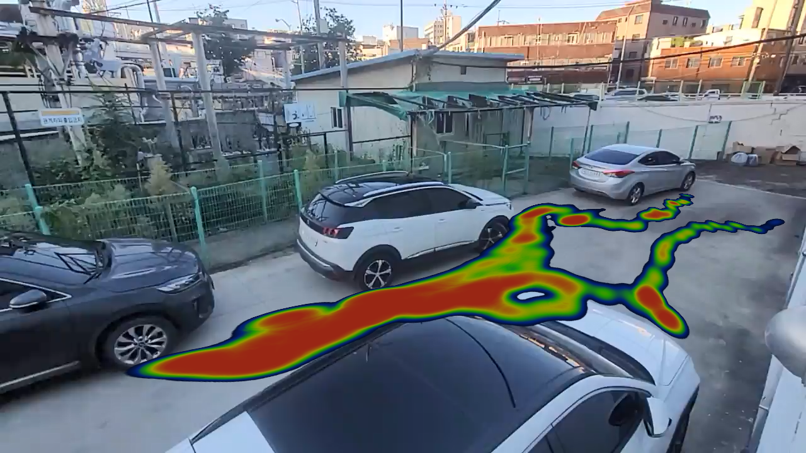

## 팀명 : 아무고나대학교

* 참가자 : 서보성, 이인규, 이충언, 김동완, 이지훈
* 설명 : cctv 동선분석 및 관심도분석 , 얼굴 탐색 및 인지 프로세스
* GUI (XD) :  https://xd.adobe.com/view/e24e5380-5151-4c0c-a28a-129463d48bf7-b71d/?fullscreen&hints=off
---

---

tensorflow gpu를 사용하기 위해선 CUDA와 cuDNN이 필요하며 버젼은 아래와 같습니다
- CUDA 10.1
- cuDNN v7.6.5
- Tensorflow 2.3.0

만약 Tensorflow가 gpu로 실행이 되는지 확인하고 싶으시면 gpu_check.py를 실행시켜 gpu가 잡히는지 확인하시면 됩니다
tensorflow 2.4.0에서는 작동하지 않습니다!

우선 이 프로젝트에는 크게 4가지 폴더가 있습니다.

- dlib 폴더에는 실시간 얼굴 감지와 얼굴 인지 그리고 사진한장으로 얼굴을 학습하는 코드가 있습니다
- heatmap 폴더에는 object_tracking 결과로 나온 position data를 이용하여 히트맵을 그리는 코드가 있습니다
- topview에서는 사진을 ipm을 통해 bird_view로 바꾸는 코드가 있습니다
- yolo3 폴더에서는 사람을 추적하는 object_traker 코드가 있습니다

venv 가상환경이나 여러 가상환경을 이용하여 새로운 가상환경을 열어주신뒤 requirements에 있는 라이브러리를 설치합니다
pip install -r ./requirements.txt

여기서 사용하는 4가지의 weight 파일들은 전부 yolo3/model_data에 모두 있습니다

object_traker.py 파일에서 저장과 가져올 파일들 변수는 모두 위에 있으며 yolo3와 yolo4의 선택 train_input_size, tiny 가중치 사용등 변수들은 yolo3/yolov3/configs.py 에 모두 있습니다

가중치 파일 주소는 다음과 같습니다

# yolov3
wget -P model_data https://pjreddie.com/media/files/yolov3.weights

# yolov3-tiny
wget -P model_data https://pjreddie.com/media/files/yolov3-tiny.weights

# yolov4
wget -P model_data https://github.com/AlexeyAB/darknet/releases/download/darknet_yolo_v3_optimal/yolov4.weights

# yolov4-tiny
wget -P model_data https://github.com/AlexeyAB/darknet/releases/download/darknet_yolo_v4_pre/yolov4-tiny.weights

heatmappy는 pip 등록이 되어있지않아 압축을 풀고 직접 setup.py를 직접 설치하셔야합니다

obejct_traker의 코드는 https://github.com/pythonlessons/TensorFlow-2.x-YOLOv3 에서 가져와 수정을 거쳤습니다